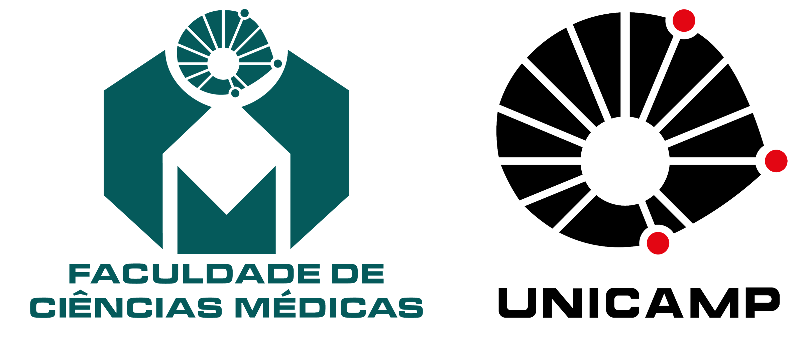
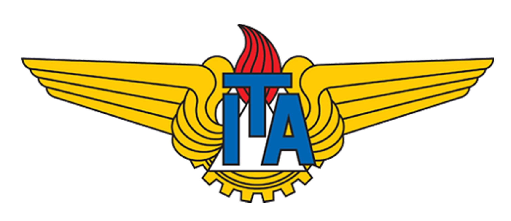

# Adeno Predict

<div align="center">
  
</div>

<div align = "center";>

## GitHub Page Authors

### Davi Ferreira MD., MSc.

[](mailto:davi.ferreira.soares@gmail.com)

### Fernanda Veloso MD., PhD. candidate

[](mailto:fernandavelosop@gmail.com)

</div>

## Introduction

<p style="text-align: justify;">

This repository (**Adeno Predict**) serves the purpose of applying machine learning algorithms to predict the consistency of pituitary macroadenomas from demographic data and brain MRI parameters.
The objective of this application is to optimize the ability to predict non-soft consistency and consequently improve surgical planning and ultimately reduce post-surgical complications.

Using a database of 70 patients from Hospital de Clínicas of the State University of Campinas (HC-UNICAMP). Our group evaluated the following classification algorithms: Decision Tree (DT), K-Nearest Neighbors (KNN), Support Vector Machine (SVM), and an ensemble of the two best models (DT and SVM).

In this repository, we organized the code according to the following steps: example dataset in the `dataset` folder (`dataset_example.csv`), imputation of missing values (`imputation`), parameter tuning flow using a Leave-One-Out cross-validation (LOOCV) strategy (`workflow_algorithms`), and metrics and bootstrap analysis (`metrics`).  

</p>

## Dataset format

<p style="text-align: justify;">

Because data collection was carried out in a single research center, it was not necessary to build a server, implement a cluster, or distributed processing. The dataset structure is similar to the provided `dataset_example.csv` in the `dataset` folder. The features used are described in `features_detail.md`.

</p>

## Imputation missing values

<p style="text-align: justify;">

The imputation process was used according to Van Buuren criteria, six values for *ADC* and eleven for *consistency*. KNN was used for deterministic process and multiple imputation by chained equations (MICE) with linear regression for stochastic methods. More information in `imputation` folder.

</p>

## Workflow algorithms

<p style="text-align: justify;">

We applied a scikit-learn pipeline to the pre-processed dataset for each algorithm, considering specifics such as standardization of numerical variables. A Leave-One-Out cross-validation (LOOCV) procedure (`leave_one_out.md`) was used to find the `best_model` for each algorithm considering the parameters (`algorithms_parameters.md`).

</p>

## Metrics and bootstrap implementation

<p style="text-align: justify;">

We used the following metrics considering the nature of the problem and its class imbalance: (1) ROC Area Under the Curve (AUC), (2) Average Precision (PR AUC), (3) Sensitivity (Recall), (4) Specificity, (5) F1 score, and (6) Matthews Correlation Coefficient (MCC). The formulas and bootstrap techniques are described in the `metrics` folder. Bootstrap was used to compute 95% confidence intervals (n = 1000) after finding the best threshold (`bootstrap_code.md`).

</p>

## 🗞️✨ Online Web Application

You can use **Adeno Predict** directly in your browser, without installing anything, through our official web page:

👉 [https://adenopredict-machine-learning.streamlit.app/](https://adenopredict-machine-learning.streamlit.app/)

**Features:**

- **📂 Dataset Prediction:** Upload a CSV file with the required columns (`age`, `sex`, `diameter`, `adc`, and optionally `consistency`) to get predictions for all patients in your dataset. Download the results and view performance metrics if ground truth is provided.
- **🙋🏻‍♀️ Individual Patient Analysis:** Manually enter the data for a single patient and instantly receive the probability and predicted tumor consistency.

This online platform provides the same experience as the local app, allowing you to use Adeno Predict from any device with internet access.

## Clone repository and application for domestic dataset

<p style="text-align: justify;">
  
We have developed a step-by-step guide, available in `clone_repository` > `repository_clone.md`, so that researchers can apply our trained model if they have the necessary information.

At the moment, this application is limited to databases that have all the required values. In the future, we will implement a method for imputing missing data.

## How to run local predictions

1. Install dependencies (preferably with `uv` or `pip`):

   ```bash
   uv sync
   # or
   pip install -e .
   ```

2. Use the Python API to predict consistency from a DataFrame:

   ```python
   import pandas as pd
   from adenopredict.inference import load_model, predict_dataframe

   df = pd.read_csv("dataset/dataset_example.csv")
   model = load_model("examples/best_model_svm.pkl")
   preds = predict_dataframe(model, df)
   print(preds.head())
   ```

3. Run the Streamlit app (localhost):

   ```bash
   streamlit run streamlit_app.py
   ```

   Upload a `.csv` with columns: `age, sex, diameter, adc` (optional `consistency`). The app returns per-row probabilities and the predicted class.

## Windows Quickstart (Streamlit App)

Follow these steps on Windows 10/11:

1) Install Python 3.11 (from the Microsoft Store or `python.org`). During setup, check "Add Python to PATH".

2) Open PowerShell and clone the repository:

```powershell
git clone https://github.com/davifmdhack/AdenoPredict.git
cd AdenoPredict
```

1. Create and activate a virtual environment:

```powershell
python -m venv .venv
.\.venv\Scripts\Activate.ps1
```

1. Install dependencies:

```powershell
pip install -e .
```

1. Run the app:

```powershell
streamlit run streamlit_app.py
```

1. Upload your CSV with columns `age, sex, diameter, adc` (optional `consistency`). The app will generate probabilities and predictions. Results are saved to `results/df_prediction-results.csv`.

## Project structure

The inference library (`adenopredict/`) is organized around small, single-responsibility modules:

- `constants.py` — single source of truth for the schema, label maps and decision threshold.
- `preprocessing.py` — deterministic feature preparation (validation + `sex` encoding + target mapping).
- `estimators.py` — substitutable `ProbabilityEstimator` strategies (`predict_proba` / `decision_function` / `predict`) following the Liskov Substitution Principle.
- `inference.py` — public API (`load_model`, `predict_dataframe`) orchestrating the modules above.

The Streamlit UI lives in `app/`, with a Streamlit-agnostic prediction service in `app/service.py`. A standalone reporting CLI is available at `examples/model_apply.py` (`python examples/model_apply.py --help`).

## Development

Install the project with development dependencies and run the quality gate (the same checks run in CI):

```bash
pip install -e ".[dev]"
ruff check .
ruff format --check .
pytest -q
```

See [`CHANGELOG.md`](CHANGELOG.md) for the history of notable changes.

---

### Article

[](https://doi.org/10.1007/s10278-025-01417-6) [](https://doi.org/10.1007/s10278-025-01417-6)
</p>

---

### How to cite us

If you want to use the **Adeno Predict model** or **Adeno Predict app** in your study, do not forget to cite us:

> Pereira, F.V., Ferreira, D., Garmes, H. et al. Machine Learning Prediction of Pituitary Macroadenoma Consistency: Utilizing Demographic Data and Brain MRI Parameters. *J Digit Imaging. Inform. med.* 38, 3484–3497 (2025). https://doi.org/10.1007/s10278-025-01417-6

---

### References (GitHub)

1. van Buuren S. Flexible Imputation of Missing Data, Second Edition. Second edition. | Boca Raton, Florida : CRC Press, [2019] |: Chapman and Hall/CRC; 2018. doi: 10.1201/9780429492259.

2. Mas̕s, S. (2021). Interpretable Machine Learning with Python : Learn to Build Interpretable High-performance Models with Hands-on Real-world Examples. 1st Edition, Packt Publishing, Birmingham.

3. Garbin, C., & Marques, O. (2022). Assessing Methods and Tools to Improve Reporting, Increase Transparency, and Reduce Failures in Machine Learning Applications in Health Care. Radiology: Artificial Intelligence, 4(2). <https://doi.org/10.1148/ryai.210127>.

4. Rouzrokh, P., Khosravi, B., Faghani, S., Moassefi, M., Garcia, D. V. V., Singh, Y., Zhang, K., Conte, G. M., & Erickson, B. J. (2022). Mitigating Bias in Radiology Machine Learning: 1. Data Handling. Radiology: Artificial Intelligence, 4(5). <https://doi.org/10.1148/ryai.210290>.

5. Faghani, S., Khosravi, B., Zhang, K., Moassefi, M., Jagtap, J. M., Nugen, F., Vahdati, S., Kuanar, S. P., Rassoulinejad-Mousavi, S. M., Singh, Y., Vera Garcia, D. v., Rouzrokh, P., & Erickson, B. J. (2022). Mitigating Bias in Radiology Machine Learning: 3. Performance Metrics. Radiology: Artificial Intelligence, 4(5). <https://doi.org/10.1148/ryai.220061>.

6. Murphy KP. Probabilistic machine learning : advanced topics. Cambridge, Massachusetts: The MIT Press; 2023.

<hr style="width: 100%;">

### Institutional

</br>
<div style="float: center;">
  
</div>

*School of Medical Sciences State University of Campinas - FCM/UNICAMP*

<hr style="width: 100%;">

### Institutional Partnership

</br>

<div style="float: center;">
  
</div>

*Aeronautics Institute of Technology - ITA*

---

**Custom License**  
***Copyright (c) 2024 Davi Ferreira***
